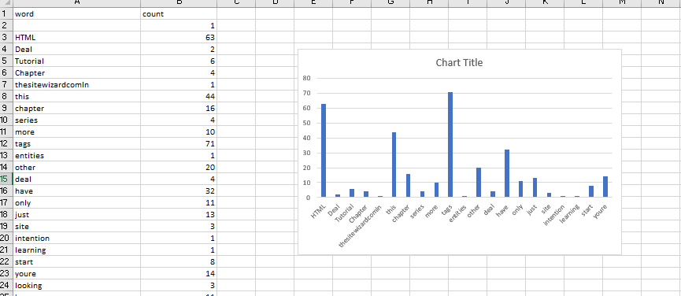

# spark-wordcount

This project lets you to implement word count using spark

#### Data Source

Data source is available at: https://www.thesitewizard.com/html-tutorial/html-4-xhtml-tutorial-2.shtml

- Using curl command I have transfered data from server to textfile

` curl https://www.thesitewizard.com/html-tutorial/html-4-xhtml-tutorial-2.shtml`

#### Data Cleaning

- Data cleaning is done using below code in jupyterlab

```
import re
cleanr = re.compile('<.*?>')
cleantext = re.sub(cleanr, '', file1)
ctext2=re.sub("[^0-9a-zA-Z ]", "", cleantext)
ctext3=re.sub(r'\b\w{1,3}\b', "", ctext2)
ctext4=re.sub(' +', ' ', ctext3)
print(ctext4)
f = open("C:/Users/S537520/Documents/output1.txt", "w")
f.write(ctext4)
f.close()
```


#### Spark setup and data processing

- Followed instructions mentioned in the `https://github.com/denisecase/setup-spark` to download and instal spark into local machine.
- To verify spark setup run `spark shell` command
- Created RDD from existing file using 
```
rd=sc.textFile("C:/Users/S537520/Documents/output1.txt")
```
- Implemented mapreduce using below code to implement word count.First used flatMap to convert line to word and the map each word to count oen atlast reduceByKey tranformation     is used to merge the values of each key using an associative reduce function.
 ```
 rd1=rd.flatMap(lambda x:x.split(" ")).map(lambda x:(x,1)).reduceByKey(lambda x,y:x+y)
 ```
 - Used ``` rd1.saveAsTextFile("C:/Users/S537520/Documents/Jaidi")``` to save the result into textfile.
 
 #### Data visualization 
 
 Created bar chart for the output result using excel
 
 
 
 #### References
 
 - https://spark.apache.org/examples.html
 - https://stackoverflow.com/questions/9662346/python-code-to-remove-html-tags-from-a-string
 - https://github.com/denisecase/setup-spark
 - https://dzone.com/articles/wordcount-with-spark-and-scala
